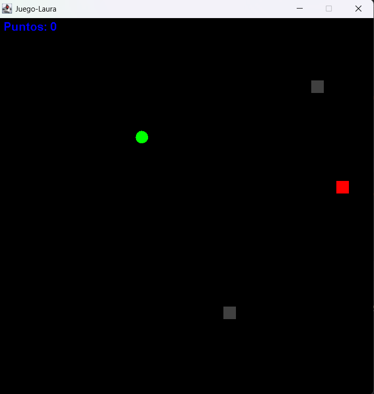
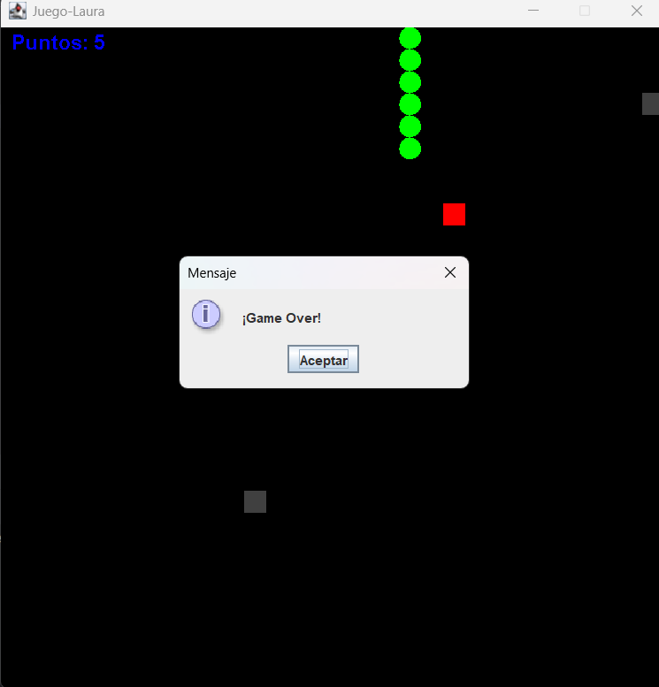

# ? Juego Snake en Java

Este es un proyecto del clásico juego **Snake**, desarrollado en Java con la biblioteca **Swing**. El juego incluye niveles progresivos, trampas aleatorias, y velocidad dinámica.



---

## ? Cómo jugar

- Usa las teclas de flechas:
    - ?? Arriba
    - ?? Abajo
    - ?? Izquierda
    - ?? Derecha
- Come la comida roja ? para ganar puntos.
- Cada 6 puntos, el nivel sube y aparecen más trampas ??.
- ¡No choques con tu propio cuerpo, los bordes o una trampa!

---

## ? Características

- ? Animación fluida con `javax.swing.Timer`
- ? Niveles automáticos cada 6 puntos
- ? Trampas generadas aleatoriamente
- ? Aumento de dificultad progresiva (velocidad)
- ? Juego completamente funcional desde cero

---

## ? Tecnologías utilizadas

- **Lenguaje**: Java 17+
- **Interfaz gráfica**: Swing (`JPanel`, `JFrame`, `Timer`)
- **IDE recomendado**: IntelliJ IDEA

---

## ?? Ejecutar el proyecto

1. Clona el repositorio:
   ```bash
   git clone https://github.com/lauraordo93/GameSnake.git
